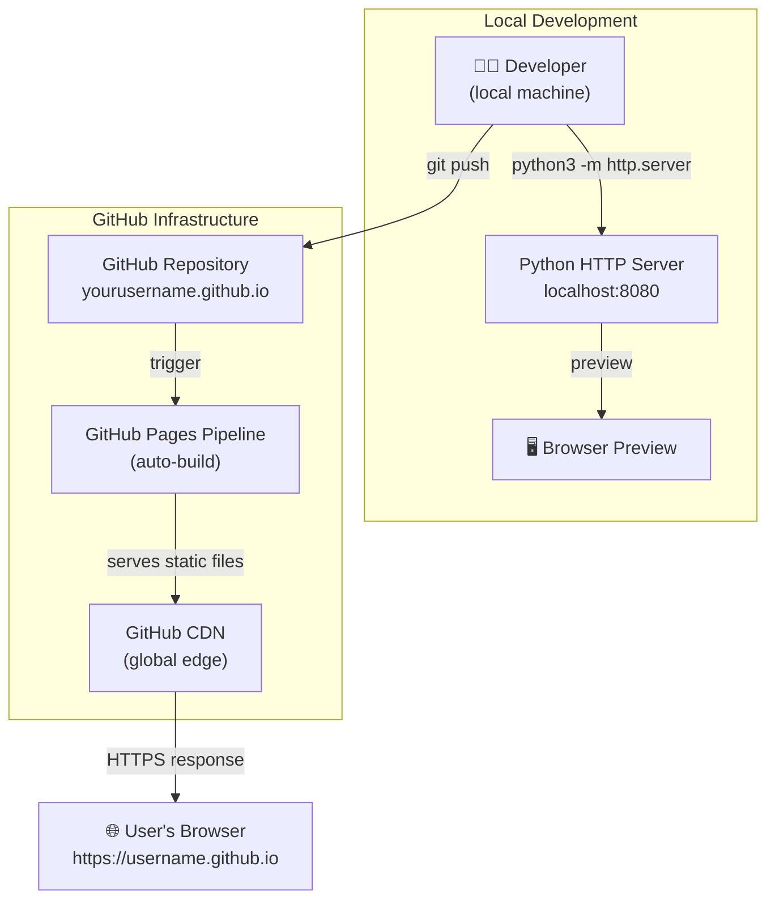
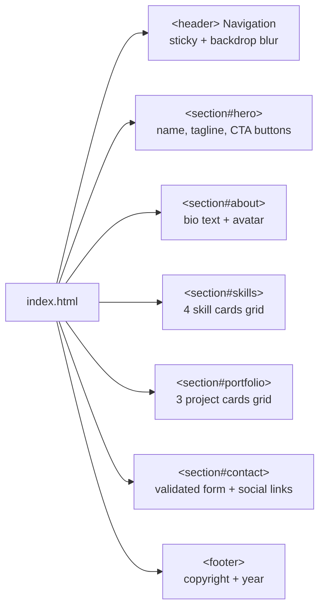
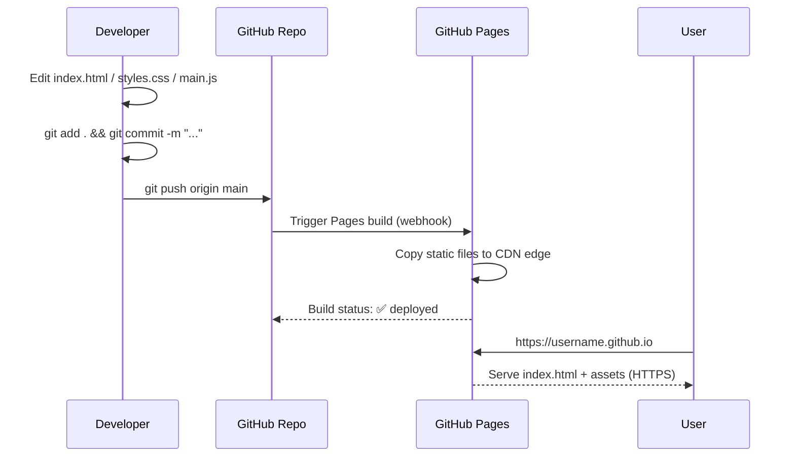

# 🏗 Architecture — GitHub Pages Personal Website

This document describes the technical architecture, data flow, and design decisions behind this static personal website.

---

## System Architecture



---

## File Structure & Responsibilities

```
yourusername.github.io/
│
├── index.html          # Single-page HTML — all sections in one file
│                       # Sections: header, hero, about, skills, portfolio, contact, footer
│
├── styles.css          # All styling — no preprocessor needed
│                       # Uses CSS custom properties (variables) for theming
│                       # Mobile-first: base styles → tablet → desktop
│                       # Sections: reset, variables, typography, layout, components, responsive
│
├── main.js             # Progressive enhancement — site works without JS
│                       # Features: nav toggle, active link highlight, scroll animations,
│                       #           form validation, toast notifications, header shadow
│
├── .gitignore          # Excludes: .env, node_modules, DS_Store, output/, input/ content
│
├── README.md           # Project overview and deployment guide
│
├── Docs/
│   ├── Quickstart.md   # Step-by-step beginner deployment guide
│   └── Architecture.md # This file — technical design documentation
│
├── scripts/
│   ├── start.sh        # Local development server (Python HTTP)
│   ├── deploy.sh       # Git add + commit + push shortcut
│   └── cleanup.sh      # Remove temp files
│
├── input/              # Reserved for input assets (gitignored content)
│   └── .gitkeep
│
└── output/             # Reserved for generated output (gitignored content)
    └── .gitkeep
```

---

## Page Architecture (Single-Page Layout)



---

## CSS Architecture

The stylesheet follows a layered approach:

```
styles.css
│
├── Layer 1: Custom Properties (:root)
│   └── Colors, fonts, spacing scale, border radii, transitions
│
├── Layer 2: Reset & Base
│   └── box-sizing, margin/padding reset, body, links, focus ring
│
├── Layer 3: Utilities
│   └── .container, .section, .section__title, .section__subtitle
│
├── Layer 4: Components
│   ├── .btn (primary, outline, sm, full variants)
│   ├── .site-header / .nav
│   ├── .hero + .hero__blob
│   ├── .about__inner (CSS Grid)
│   ├── .skills__grid + .skill-card
│   ├── .portfolio__grid + .project-card
│   ├── .contact__form + .form-group
│   └── .site-footer
│
└── Layer 5: Responsive overrides
    ├── @media (max-width: 768px) — tablet/mobile nav, stacked about
    ├── @media (max-width: 480px) — single-column grids
    └── @media (prefers-reduced-motion) — respects OS accessibility setting
```

---

## JavaScript Architecture

`main.js` is structured as **immediately-invoked function expressions (IIFEs)** — each feature is self-contained and has no global state:

```
main.js
│
├── setYear()           — auto-updates footer copyright year
├── mobileNav()         — hamburger toggle with ARIA attributes
├── activeNavOnScroll() — IntersectionObserver highlights current section nav link
├── scrollAnimations()  — IntersectionObserver adds .animate-in to [data-animate] elements
├── contactForm()       — validates name/email/message, submits via mailto or Formspree
└── headerShadow()      — adds box-shadow to sticky header on scroll
```

**Progressive Enhancement:** The website is fully functional with JavaScript disabled. JS only enhances UX (animations, form validation, nav toggle for mobile).

---

## Deployment Flow



---

## Design Decisions

| Decision | Rationale |
|---|---|
| No build tools (Webpack, Vite, etc.) | Zero configuration, instant deployment, beginner-friendly |
| No CSS framework (Bootstrap, Tailwind) | Full control, no unused CSS, teaches fundamentals |
| No JS framework (React, Vue) | Static site doesn't need component hydration |
| Dark theme by default | GitHub-native aesthetic; easy to switch via CSS vars |
| CSS custom properties for theming | Single-point updates — change accent colour in one place |
| Mobile-first CSS | Ensures base styles target smallest screen; additions for larger |
| Vanilla JS IIFEs | No global scope pollution; each feature isolated and testable |
| IntersectionObserver for animations | No scroll event polling; performant and battery-friendly |
| `prefers-reduced-motion` media query | WCAG 2.1 AA accessibility compliance |

---

## Performance Characteristics

| Metric | Value |
|---|---|
| Total size (HTML+CSS+JS) | ~30 KB uncompressed |
| External dependencies | 1 Google Font (optional, removable) |
| HTTP requests | 3 (HTML, CSS, JS) + 1 font |
| Time-to-interactive | < 1 second on fast connection |
| Lighthouse score target | 90+ across all categories |

To remove the Google Font dependency, delete the `<link>` tags in `<head>` and change `--font-sans` in `styles.css` to use only system fonts:

```css
--font-sans: -apple-system, BlinkMacSystemFont, 'Segoe UI', sans-serif;
```

---

## Security Considerations

- No server-side code → no server attack surface
- No API keys or secrets (form uses `mailto:` by default)
- Content Security Policy headers can be added via a `_headers` file if migrating to Netlify
- HTTPS enforced automatically by GitHub Pages (Let's Encrypt)
- All external links use `rel="noopener noreferrer"` to prevent tab-napping
